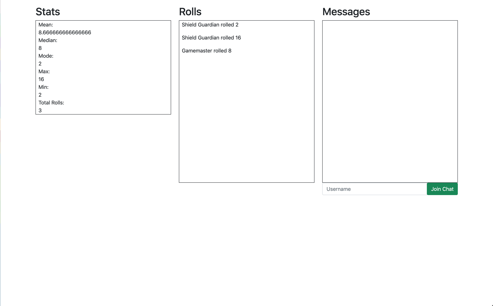

# FoundryStats

## What is it?
FoundryStats is a project I made to keep track of rolls made in [FoundryVTT](https://foundryvtt.com/)

It consists of a Discord bot listening to a server, to which rolls are sent by a module in Foundry, and from which rolls are sent to a webpage, which displays them along with some statistics and a simple chatbox.

## How do I use it?
### The short version: Visit [this webpage]()
From there you can watch rolls appear in real time, pick a username and begin chatting with anyone else connected

### The long version, or how to get your own rolls:
1. First you need a Foundry license (which I highly recommend if you're looking for an online platform to play Dungeons & Dragons or other tabletop games)
2. Follow the instructions in the module that makes this all possible: [DiscordConnect](https://github.com/caoranach/DiscordConnect) (Note: the only settings that are optional the Main GM ID and the Webhook URL. FoundryStats only requires the rolls)
3. Add the [FoundryStats discord bot](https://discord.com/api/oauth2/authorize?client_id=898341283783909376&permissions=67584&scope=bot) to your server
4. Now, any roll made in Foundry will be listened to and parsed by the bot, then added to the FoundryStats website!

Currently, there is no real way to separate rolls, so if multiple people have this set up, FoundryStats displays all of them in one session

It is, however, possible to fork this site and make your own instance of everything here, which would result in a private session

To do so:
1. Run `git clone https://github.com/Evansdava/FoundryStats` in your terminal
2. Run `npm install` inside the cloned folder to install dependencies
3. Create a file named `.env`
4. Make a Discord application/bot from [this page](https://discord.com/developers) ([this tutorial has more details](https://www.sitepoint.com/discord-bot-node-js/))
5. Copy the bot's token into your `.env` file (should look like `TOKEN=yourTokenHere`)
6. Run node app.js
7. Navigate to https://localhost:3000 and enjoy!

## Planned Features
This was made for a short-term school project, so continued development is not guaranteed, however if I do further work on it I want to add
* Individual rooms/channels for different games
* Per-character stat tracking
* Distinction between rolls and total results after modifiers (currently it only follows results)
* Better chat
* Visualizations and graphs of various statistics
* Longer-term saving of data